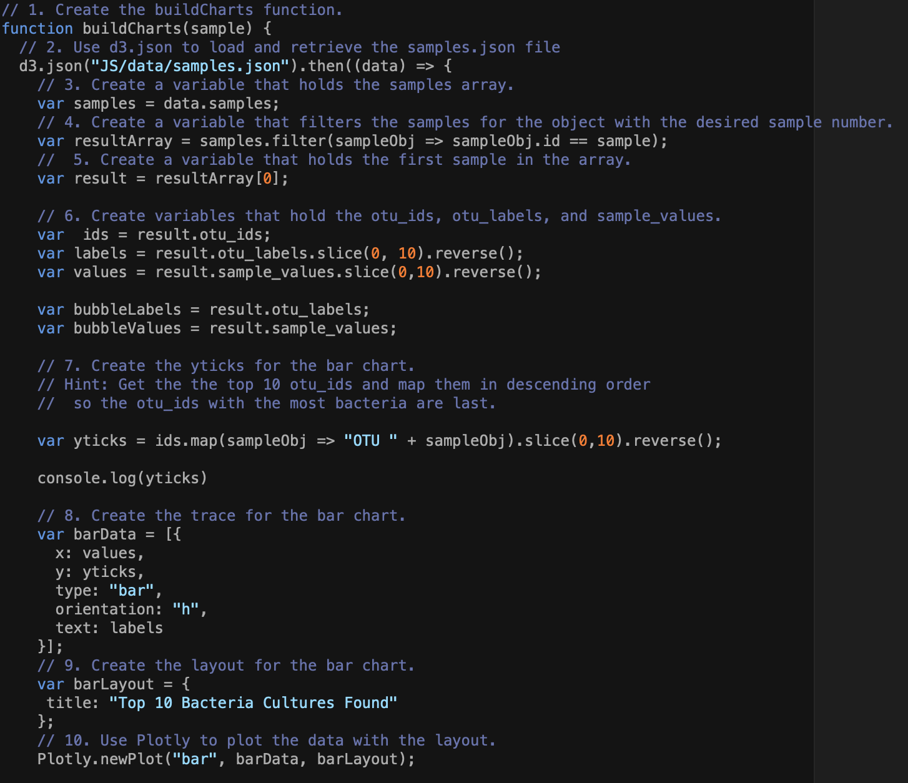
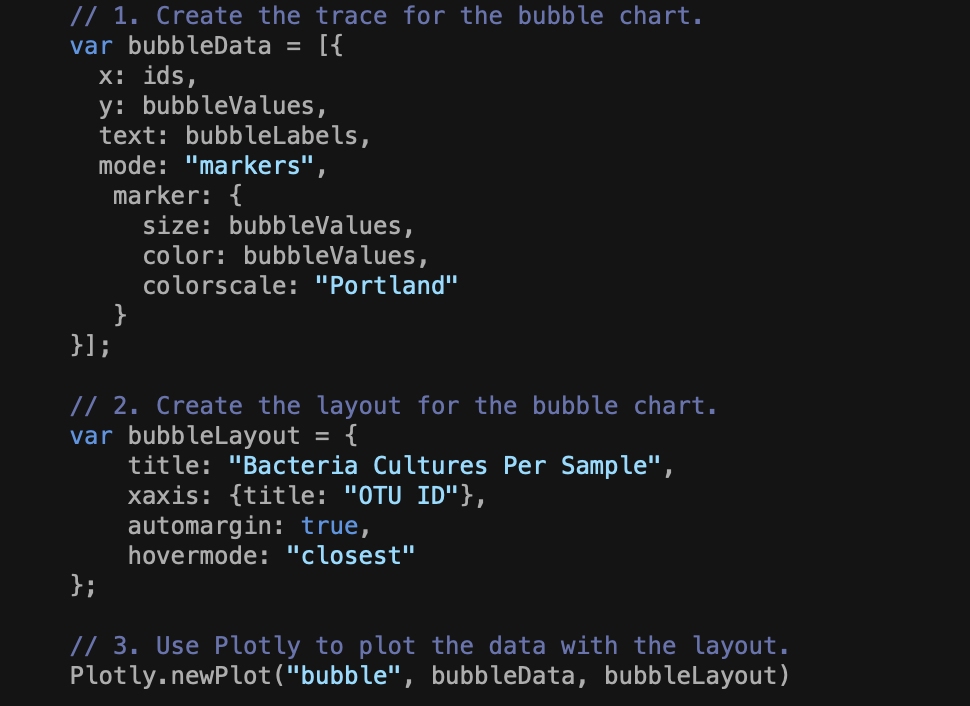
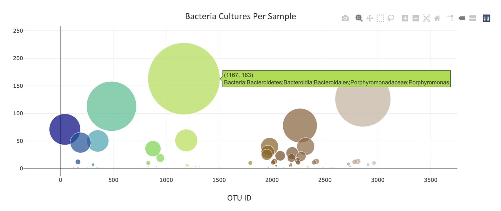
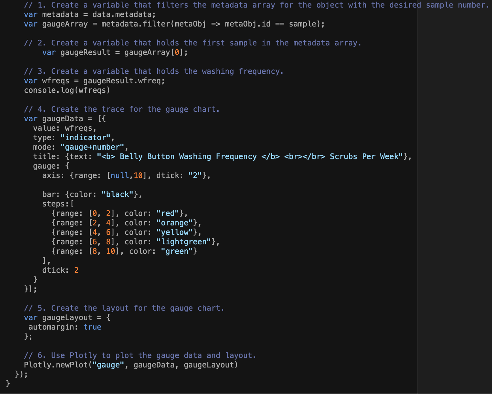
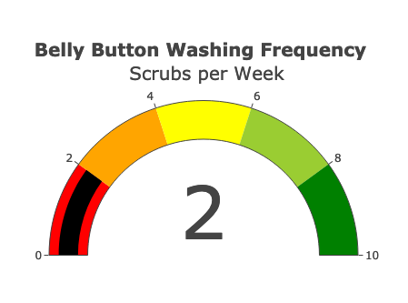

# Plotly

# Purpose of Repository

# Deliverable 1 Requirements

1. Code is written to create the arrays when a sample is selected from the dropdown menu

2. Code is written to create the trace object in the buildCharts() function, and it contains the following:
- The y values are the otu_ids in descending order
- The x values are the sample_values in descending order
- The hover text is the otu_labels in descending order.
  
3. Code is written to create the layout array in the buildCharts() function that creates a title for the chart

4. When the dashboard is first opened in a browser, ID 940’s data should be displayed in the dashboard, and the bar chart has the following:
- The top 10 sample_values are sorted in descending order
- The top 10 sample_values as values
- The otu_ids as the labels

# Deliverable 2 Requirements

1. The code for the trace object in the buildCharts(); function does the following:
- Sets the otu_ids as the x-axis values
- Sets the sample_values as the y-axis values
- Sets the otu_labels as the hover-text values
- Sets the sample_values as the marker size
- Sets the otu_ids as the marker colors

2. The code for the layout in the buildCharts(); function does the following:
- Creates a title
- Creates a label for the x-axis
- The text for a bubble is shown when hovered over

3. When the dashboard is first opened in a browser, ID 940’s data should be displayed in the dashboard. All three charts should also be working according to their requirements when a sample is selected from the dropdown menu

# Deliverable 3 Requirements

1. The code to build the gauge chart does the following:
- Creates a title for the chart.
- Creates the ranges for the gauge in increments of two, with a different color for each increment.
- Adds the washing frequency value on the gauge chart.
- The indicator shows the level for the washing frequency on the gauge.
- The gauge is added to the dashboard.
- The gauge fits in the margin of the 
 element.

2. When the webpage loads, the bar and bubble chart are working according to the requirements in Deliverable 1 and 2, respectively, and the gauge chart is working according to the requirements listed for this Deliverable

----

---- 

# Deliverable 4 Requirements
1. The webpage has three customizations.
2. When the dashboard is first opened in a browser, ID 940’s data should be displayed in the dashboard, and all three charts should be working according to the requirements when a sample is selected from the dropdown menu
